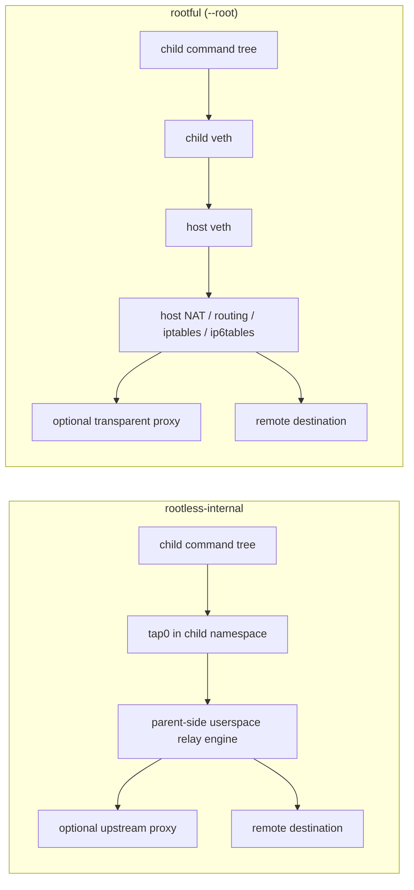

childflow
===

`childflow` is a Linux-only CLI for running a child process tree inside an isolated network namespace, forcing DNS / proxy behavior for that tree, and capturing only that tree's traffic.

## Description

`childflow` launches a command in an isolated networking environment and applies network controls only to the spawned process tree.

It is designed for cases like:

- forcing a specific DNS resolver only for the target command tree
- overlaying a custom `/etc/hosts` view only for the target command tree
- sending outbound TCP through an upstream HTTP / HTTPS / SOCKS5 proxy even when the target binary does not honor proxy environment variables
- capturing only the packets emitted by that target command tree

`childflow` currently provides two Linux backends:

- `rootless-internal`
  default backend. Experimental, easier to try, and designed to work without external helpers such as `pasta` or `slirp4netns`
- `rootful`
  enabled with `--root`. Feature-complete backend built on veth, routing, iptables / ip6tables, and host-side capture

### Features

- Run a child process tree inside an isolated network namespace
- Force DNS to a specific IPv4 or IPv6 resolver
- Overlay an `/etc/hosts`-format file only for the target command tree
- Relay outbound TCP directly or through HTTP / HTTPS / SOCKS5 upstream proxies
- Relay outbound UDP on the default rootless backend
- Support IPv4 / IPv6 `ping`, UDP-style `traceroute`, and ICMP-mode `traceroute` on the default rootless backend
- Capture only the target command tree's traffic as `pcapng`
- Choose between a quick rootless backend and a more complete rootful backend

## Install

### Build from source

```bash
cargo build --release
sudo install -m 0755 target/release/childflow /usr/local/bin/childflow
```

### Requirements

Host requirements:

- Linux only
- `ip`
- `iptables`
- `ip6tables`

Additional `rootless-internal` requirements:

- user, network, and mount namespace support
- `/dev/net/tun`
- user namespaces enabled on the host
- `uidmap` is recommended on Debian / Ubuntu style systems for `newuidmap` / `newgidmap` fallback

Additional `rootful` requirements:

- root privileges
- writable `/proc/sys/net/ipv4/ip_forward`
- writable `/proc/sys/net/ipv6/conf/all/forwarding`
- Linux features required for TPROXY when proxy interception is used

If you are evaluating from macOS or another non-Linux environment, use the Docker workflows instead of trying to run the binary directly.

## Usage

### Command

```bash
childflow [OPTIONS] -- <command> [args...]
```

### Help

`childflow --help` gives you the full CLI reference. The main shape is:

```text
Launch a child process tree inside its own netns and capture only its packets

Usage:
  childflow [OPTIONS] -- <COMMAND>...

Options:
  -o, --output <PATH>            Write only the target command tree's traffic as pcapng
      --root                     Use the rootful backend
  -d, --dns <IP>                 Force DNS traffic for the child tree to this resolver
      --hosts-file <PATH>        Overlay an /etc/hosts-format file for the child tree
  -p, --proxy <URI>              Upstream proxy: http://, https://, or socks5://
      --proxy-user <USER>        Username for upstream proxy authentication
      --proxy-password <PASS>    Password for upstream proxy authentication
      --proxy-insecure           Ignore certificate trust errors for https proxies
  -i, --iface <NAME>             Force host-side direct egress interface on --root
  -h, --help                     Print help
  -V, --version                  Print version
```

### Options

Main options:

- `--root`
  use the rootful backend instead of the default rootless backend
- `-o, --output <PATH>`
  write captured traffic as `pcapng`
- `-d, --dns <IP>`
  force DNS to the specified IPv4 or IPv6 resolver
- `--hosts-file <PATH>`
  overlay an `/etc/hosts`-format file for the target command tree
- `-p, --proxy <URI>`
  configure an upstream `http://`, `https://`, or `socks5://` proxy
- `--proxy-user <USER>`
  username for proxy authentication
- `--proxy-password <PASS>`
  password for proxy authentication
- `--proxy-insecure`
  ignore certificate trust failures for `https://` upstream proxies while still validating the hostname
- `-i, --iface <NAME>`
  force direct host-side egress through a specific interface on `--root`

Notes:

- `--iface` is not supported by `rootless-internal`
- `--proxy-insecure` is valid only for `https://` upstream proxies
- `rootful` currently requires `--output`

### Backend Comparison

| Feature | `rootless-internal` | `rootful` |
| --- | --- | --- |
| Isolated execution | Yes | Yes |
| DNS override | Yes | Yes |
| `/etc/hosts` override | Yes | Yes |
| Outbound TCP | Yes | Yes |
| UDP relay | Yes | Yes |
| Proxy support | Yes, via parent-side relay engine | Yes, via transparent interception path |
| Transparent proxy / TPROXY | No | Yes |
| `--iface` | No | Yes |
| Packet capture | Yes, at tap / engine boundary | Yes, at host-side veth |
| Status | Experimental default backend | Current feature-complete backend |

### Which backend should I use?

Use `rootless-internal` when you want the quickest path to isolated execution, DNS control, proxying, and capture without host-wide rootful setup.

Use `--root` when you need the current feature-complete path, including:

- transparent proxying
- interface-forced direct egress with `--iface`
- broader raw-ICMP behavior than the current rootless relay engine implements

### Backend Diagram



In short:

- `rootless-internal` keeps more of the networking logic in a parent-side userspace relay attached to `tap0`
- `rootful` pushes more of the data path into Linux host networking with veth, routing, NAT, and optional transparent interception

### Packet Capture

`childflow` is intended to capture only the target command tree's traffic, not unrelated host traffic.

Capture behavior differs by backend:

- `rootless-internal`
  capture is written at the `tap0` / userspace engine boundary
- `rootful`
  capture is taken on the host-side veth before later host-side proxying, NAT, or routing stages

That means capture files show the isolated child-side traffic view, not arbitrary host traffic.

### Docker Workflows

If you are developing or evaluating from a non-Linux host, use the included Docker workflows:

- Developer environment: [docker/dev/README.md](docker/dev/README.md)
- Demo environment: [docker/demo/README.md](docker/demo/README.md)

### Troubleshooting

Useful checks:

```bash
which ip iptables ip6tables
childflow -- true
sudo childflow --root -o /tmp/test.pcapng -- true
docker compose -f docker/dev/compose.yml run --rm childflow-dev cargo test
```

Common issues:

- `ip`, `iptables`, or `ip6tables` not found
  install `iproute2` and the appropriate firewall userspace package
- `rootless-internal` preflight fails
  check user namespace availability, `/dev/net/tun`, and `/proc/self/ns/{user,net,mnt}`
- non-root `rootless-internal` namespace setup fails
  install `uidmap`, check `/etc/subuid` and `/etc/subgid`, then retry with `CHILDFLOW_DEBUG=1`
- proxy mode does not seem to apply
  verify that the configured upstream proxy is reachable from the parent namespace
- packet capture fails to start
  verify AF_PACKET support or rootless tap access, depending on the selected backend

For lower-level backend details, limitations, and maintainer-oriented validation commands, see [docs/technical-details.md](docs/technical-details.md).

### Limitations

- Linux only
- backend support is still asymmetric: `rootful` is the feature-complete path, while `rootless-internal` is still experimental
- proxy mode currently targets TCP traffic
- arbitrary non-echo ICMP on the rootless backend still depends on host raw-socket capabilities
- abnormal termination can still leave partial host-side network changes behind even though rollback is attempted

## Example

### Run a command

Run a command with the default backend.

```bash
childflow -- curl https://example.com
```

### Capture only the target command tree

Write only the target command tree's traffic as `pcapng`.

```bash
childflow -o rootless.pcapng -- curl https://example.com
```

```shell
childflow@docker-desktop:/workspaces/childflow$ ./target/debug/childflow -o /tmp/rootless.pcapng -- curl https://example.com
<!doctype html><html lang="en"><head><title>Example Domain</title><meta name="viewport" content="width=device-width, initial-scale=1"><style>body{background:#eee;width:60vw;margin:15vh auto;font-family:system-ui,sans-serif}h1{font-size:1.5em}div{opacity:0.8}a:link,a:visited{color:#348}</style></head><body><div><h1>Example Domain</h1><p>This domain is for use in documentation examples without needing permission. Avoid use in operations.</p><p><a href="https://iana.org/domains/example">Learn more</a></p></div></body></html>
childflow@docker-desktop:/workspaces/childflow$
childflow@docker-desktop:/workspaces/childflow$ tcpdump -nn -tttt -r /tmp/rootless.pcapng
reading from file /tmp/rootless.pcapng, link-type EN10MB (Ethernet), snapshot length 65535
2026-04-19 14:04:22.520526 IP6 :: > ff02::16: HBH ICMP6, multicast listener report v2, 2 group record(s), length 48
2026-04-19 14:04:22.530769 IP 10.240.153.78.60415 > 10.240.153.77.53: 5035+ A? example.com. (29)
2026-04-19 14:04:22.533252 IP 10.240.153.77.53 > 10.240.153.78.60415: 5035 2/0/0 A 104.20.23.154, A 172.66.147.243 (83)
2026-04-19 14:04:22.533269 IP 10.240.153.78.60415 > 10.240.153.77.53: 28584+ AAAA? example.com. (29)
2026-04-19 14:04:22.533280 IP 10.240.153.77.53 > 10.240.153.78.60415: 28584 0/0/0 (29)
2026-04-19 14:04:22.543459 IP 10.240.153.78.35950 > 104.20.23.154.443: Flags [S], seq 832149090, win 64240, options [mss 1460,sackOK,TS val 2711618706 ecr 0,nop,wscale 7], length 0
2026-04-19 14:04:22.548625 IP 104.20.23.154.443 > 10.240.153.78.35950: Flags [S.], seq 548580286, ack 832149091, win 64240, length 0
2026-04-19 14:04:22.548656 IP6 :: > ff02::16: HBH ICMP6, multicast listener report v2, 2 group record(s), length 48
2026-04-19 14:04:22.548670 IP 10.240.153.78.35950 > 104.20.23.154.443: Flags [.], ack 1, win 64240, length 0
2026-04-19 14:04:22.559116 IP 10.240.153.78.35950 > 104.20.23.154.443: Flags [.], seq 1:537, ack 1, win 64240, length 536
2026-04-19 14:04:22.559158 IP 104.20.23.154.443 > 10.240.153.78.35950: Flags [.], ack 537, win 64240, length 0
2026-04-19 14:04:22.559165 IP 10.240.153.78.35950 > 104.20.23.154.443: Flags [P.], seq 537:1073, ack 1, win 64240, length 536
2026-04-19 14:04:22.559174 IP 104.20.23.154.443 > 10.240.153.78.35950: Flags [.], ack 1073, win 64240, length 0
2026-04-19 14:04:22.559178 IP 10.240.153.78.35950 > 104.20.23.154.443: Flags [P.], seq 1073:1572, ack 1, win 64240, length 499
2026-04-19 14:04:22.559185 IP 104.20.23.154.443 > 10.240.153.78.35950: Flags [.], ack 1572, win 64240, length 0
2026-04-19 14:04:22.795643 IP 104.20.23.154.443 > 10.240.153.78.35950: Flags [P.], seq 1:5062, ack 1572, win 64240, length 5061
2026-04-19 14:04:22.795703 IP 10.240.153.78.35950 > 104.20.23.154.443: Flags [.], ack 5062, win 59860, length 0
2026-04-19 14:04:22.806508 IP 10.240.153.78.35950 > 104.20.23.154.443: Flags [P.], seq 1572:1652, ack 5062, win 62780, length 80
2026-04-19 14:04:22.806551 IP 104.20.23.154.443 > 10.240.153.78.35950: Flags [.], ack 1652, win 64240, length 0
2026-04-19 14:04:22.806556 IP 10.240.153.78.35950 > 104.20.23.154.443: Flags [P.], seq 1652:1775, ack 5062, win 62780, length 123
2026-04-19 14:04:22.806564 IP 104.20.23.154.443 > 10.240.153.78.35950: Flags [.], ack 1775, win 64240, length 0
2026-04-19 14:04:22.838381 IP6 :: > ff02::1:ff42:d970: ICMP6, neighbor solicitation, who has fe80::84c5:37ff:fe42:d970, length 32
2026-04-19 14:04:22.919453 IP 104.20.23.154.443 > 10.240.153.78.35950: Flags [P.], seq 5062:5606, ack 1775, win 64240, length 544
2026-04-19 14:04:22.919542 IP 104.20.23.154.443 > 10.240.153.78.35950: Flags [P.], seq 5606:5637, ack 1775, win 64240, length 31
2026-04-19 14:04:22.919554 IP 10.240.153.78.35950 > 104.20.23.154.443: Flags [.], ack 5606, win 62780, length 0
2026-04-19 14:04:22.919565 IP 10.240.153.78.35950 > 104.20.23.154.443: Flags [.], ack 5637, win 62780, length 0
2026-04-19 14:04:22.929850 IP 104.20.23.154.443 > 10.240.153.78.35950: Flags [P.], seq 5637:6385, ack 1775, win 64240, length 748
2026-04-19 14:04:22.929878 IP 10.240.153.78.35950 > 104.20.23.154.443: Flags [P.], seq 1775:1806, ack 5637, win 62780, length 31
2026-04-19 14:04:22.929921 IP 104.20.23.154.443 > 10.240.153.78.35950: Flags [.], ack 1806, win 64240, length 0
2026-04-19 14:04:22.929928 IP 10.240.153.78.35950 > 104.20.23.154.443: Flags [.], ack 6385, win 62780, length 0
2026-04-19 14:04:22.940143 IP 10.240.153.78.35950 > 104.20.23.154.443: Flags [P.], seq 1806:1854, ack 6385, win 62780, length 48
2026-04-19 14:04:22.940227 IP 104.20.23.154.443 > 10.240.153.78.35950: Flags [.], ack 1854, win 64240, length 0
2026-04-19 14:04:22.940234 IP 10.240.153.78.35950 > 104.20.23.154.443: Flags [P.], seq 1854:1878, ack 6385, win 62780, length 24
2026-04-19 14:04:22.940243 IP 104.20.23.154.443 > 10.240.153.78.35950: Flags [.], ack 1878, win 64240, length 0
2026-04-19 14:04:22.940247 IP 10.240.153.78.35950 > 104.20.23.154.443: Flags [F.], seq 1878, ack 6385, win 62780, length 0
2026-04-19 14:04:22.940267 IP 104.20.23.154.443 > 10.240.153.78.35950: Flags [.], ack 1879, win 64240, length 0
2026-04-19 14:04:23.158199 IP 104.20.23.154.443 > 10.240.153.78.35950: Flags [F.], seq 6385, ack 1879, win 64240, length 0
2026-04-19 14:04:23.158235 IP 10.240.153.78.35950 > 104.20.23.154.443: Flags [.], ack 6386, win 62780, length 0
```

### Force DNS

Force DNS only for the target command tree.

```bash
childflow -d 1.1.1.1 -- curl https://example.com
```

### Overlay a hosts file

Overlay a custom hosts file only for the target command tree.

```bash
childflow --hosts-file ./hosts.override -- curl http://demo.internal
```

### Use an upstream proxy

Relay outbound TCP through an upstream proxy.

```bash
childflow -p http://127.0.0.1:8080 -- curl https://example.com
```

### Use proxy authentication

Run with authenticated upstream proxy settings.

```bash
childflow \
  -p https://proxy.example.com:443 \
  --proxy-user alice \
  --proxy-password secret \
  -- curl https://example.com
```

### Use the rootful backend

Use the feature-complete rootful backend.

```bash
sudo childflow --root -o capture.pcapng -- curl https://example.com
```

### Run ping

Run `ping` through the default rootless backend.

```bash
childflow -- ping -c 1 8.8.8.8
childflow -- ping -6 -c 1 2606:4700:4700::1111
```

### Run traceroute

Run both UDP-style and ICMP-mode `traceroute`.

```bash
childflow -- traceroute -n -q 1 -w 2 8.8.8.8
childflow -- traceroute -I -n -q 1 -w 2 8.8.8.8
```

## License

MIT. See [LICENSE](LICENSE).
