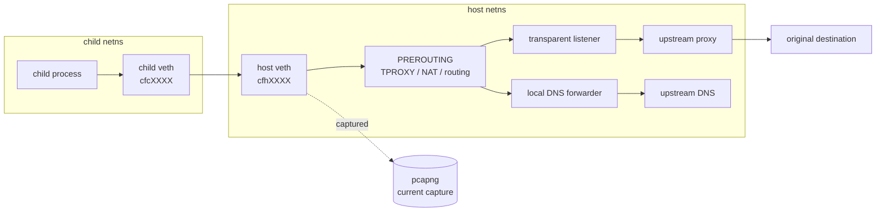

childflow
===

`childflow` is a Linux-only CLI tool for running a child process tree inside its own network namespace while:

- overriding DNS with an IPv4 or IPv6 resolver
- forcing direct egress through a specific host interface
- redirecting TCP traffic through an upstream HTTP, HTTPS, or SOCKS5 proxy with transparent interception
- capturing only the packets that originate from the target process tree

It now has explicit backend selection:

- `rootful`: current production path based on veth, routing, iptables/ip6tables, and host-side capture
- `rootless-internal`: experimental backend under construction for internal userspace networking without external tools such as `pasta` or `slirp4netns`

It is still a low-level networking tool. The goal of the `develop` branch is to make it easier to try safely, easier to validate in CI, and easier to debug when the host environment is missing a requirement.

## Overview

Today, the default `rootful` backend creates a dedicated child network namespace, wires it to the host with a veth pair, enables forwarding/NAT, optionally installs TPROXY and policy-routing rules, then runs your target command inside that namespace.

The resulting capture is scoped to traffic from the target process tree rather than the whole host.

The `rootless-internal` backend is still experimental and not yet functionally complete. Phase 3 adds a minimal internal userspace relay engine so the child can use `tap0` for isolated execution, DNS relay, and outbound TCP without depending on `pasta` or `slirp4netns`.

## Requirements

Host requirements:

- Linux only
- `ip`
- `iptables`
- `ip6tables`
- kernel support for network namespaces, policy routing, and veth

Backend-specific requirements:

- `rootful`
  - root privileges
  - writable `/proc/sys/net/ipv4/ip_forward` and `/proc/sys/net/ipv6/conf/all/forwarding`
- `rootless-internal` experimental
  - Linux namespace support for user, network, and mount namespaces
  - `/dev/net/tun`
  - user namespace support enabled on the host

Feature-specific requirements:

- transparent proxy mode additionally depends on Linux TPROXY support such as `xt_TPROXY`, `xt_socket`, and `IP_TRANSPARENT`
- packet capture depends on AF_PACKET support and privileges equivalent to `CAP_NET_RAW`
- the host must allow writes to `/proc/sys/net/ipv4/ip_forward` and `/proc/sys/net/ipv6/conf/all/forwarding`

Why root is required for `rootful`:

- create network and mount namespaces
- create/move veth interfaces
- modify routing, policy routing, `iptables`, `ip6tables`, and sysctls
- open AF_PACKET capture sockets
- use transparent proxy sockets

If you are evaluating from macOS or another non-Linux environment, use the Docker demo instead of trying to run the binary directly.

## Install

Build locally:

```bash
cargo build --release
sudo install -m 0755 target/release/childflow /usr/local/bin/childflow
```

Check the main help:

```bash
childflow --help
```

## Demo

The Docker-based demo under [docker/demo/README.md](docker/demo/README.md) is the safest way to understand the behavior before touching a real host.

Use the demo when you want to:

- confirm the basic namespace / proxy / capture flow works
- try the HTTPS proxy and test endpoints quickly
- avoid modifying your day-to-day Linux host while evaluating the project

The GitHub Actions `demo-test.yml` workflow uses this path as an integration-oriented check. The regular CI workflow is intentionally separate and lighter.

## Usage

Basic forms:

```bash
sudo childflow --network-backend rootful -o <output.pcapng> [options...] -- <command> [args...]
childflow --network-backend rootless-internal [options...] -- <command> [args...]
```

Options:

- `--network-backend <rootful|rootless-internal>`: select the networking backend, default `rootful`
- `-o, --output <PATH>`: write captured traffic as `pcapng` on backends that support capture
- `-d, --dns <IP>`: force DNS to a specific IPv4 or IPv6 resolver
- `-p, --proxy <URI>`: force TCP traffic through an upstream `http://`, `https://`, or `socks5://` proxy
- `--proxy-user <USER>`: username for proxy authentication
- `--proxy-password <PASS>`: password for proxy authentication
- `--proxy-insecure`: ignore certificate trust failures for `https://` upstream proxies while still using the proxy hostname for TLS
- `-i, --iface <NAME>`: force direct host-side egress through a specific interface

Proxy option notes:

- `HTTP`: sends CONNECT over plain TCP to the upstream proxy
- `HTTPS`: sends CONNECT over TLS to the upstream proxy
- `SOCKS5`: negotiates a SOCKS5 CONNECT tunnel
- `--proxy-user` and `--proxy-password` must be supplied together
- `--proxy-insecure` is only meaningful with `https://` upstream proxies
- proxy options currently only work with the `rootful` backend

Backend notes:

- `rootful` currently requires `--output`
- `rootless-internal` currently rejects `--output`, `--iface`, and transparent proxy related options because those paths are not implemented yet
- `rootless-internal` is experimental and under construction
- at this phase, `rootless-internal` supports child isolation, child-side DNS override plumbing, outbound TCP, and DNS UDP relay
- non-DNS UDP, transparent proxy / TPROXY, `--iface`, and the current AF_PACKET capture path are still intentionally unsupported on `rootless-internal`

Examples:

```bash
sudo childflow -o capture.pcapng -- curl https://example.com
sudo childflow --network-backend rootful -o capture.pcapng -- curl https://example.com
sudo childflow -o capture.pcapng -d 1.1.1.1 -- curl https://example.com
sudo childflow -o capture.pcapng -d 2606:4700:4700::1111 -- curl https://example.com
sudo childflow -o capture.pcapng -p http://127.0.0.1:8080 -- curl https://example.com
sudo childflow -o capture.pcapng -p socks5://127.0.0.1:1080 -- curl https://example.com
sudo childflow -o capture.pcapng -p https://proxy.example.com:443 --proxy-user alice --proxy-password secret -- curl https://example.com
sudo childflow -o capture.pcapng -p https://proxy.example.com:443 --proxy-insecure -- curl https://example.com
sudo childflow -o capture.pcapng -i eth0 -- curl https://example.com
childflow --network-backend rootless-internal -- true
childflow --network-backend rootless-internal -d 1.1.1.1 -- curl https://example.com
```

## Backend Matrix

| Feature | `rootful` | `rootless-internal` |
| --- | --- | --- |
| Isolated execution | Yes | Yes |
| DNS override | Yes | Yes, via child `resolv.conf` rewrite and internal DNS relay |
| Outbound TCP | Yes | Yes |
| UDP | Yes | DNS-only in phase 3 |
| Explicit proxy path | Yes, via current transparent interception path | Not yet supported |
| Transparent proxy / TPROXY | Yes | Not supported |
| `--iface` | Yes | Not supported |
| Current packet capture path | Yes | Not supported |
| Namespace + `tap0` + child routes | Yes | Yes |
| Status | Current backend | Experimental / phase-3 minimal relay engine |

## How It Works

1. `childflow` validates CLI arguments and runs backend-specific preflight checks.
2. A child process is forked, then unshares backend-specific namespaces.
3. A veth pair connects the child namespace to the host namespace.
4. The host namespace enables forwarding and installs IPv4 / IPv6 NAT and forwarding rules.
5. Optional policy-routing rules force direct traffic out through `--iface`.
6. Optional TPROXY rules redirect TCP traffic to the local transparent listener, which then connects to the configured upstream proxy.
7. Packet capture runs on the host-side veth.

IPv4 and IPv6 are both provisioned inside the child namespace. DNS override accepts either family, and direct routing setup configures both IPv4 and IPv6 default paths.

For `rootless-internal`, the current phase creates `tap0`, rewrites the child resolver to the internal gateway, relays DNS over UDP, and opens outbound TCP sockets from the parent-side userspace engine. Non-DNS UDP, transparent proxying, `--iface`, and the current AF_PACKET capture path remain later phases.

## Packet Capture Behavior

Capture happens on the host-side veth, shown below as `cfhXXXX`.



What is captured:

- packets emitted by the target process tree into the isolated namespace
- DNS requests from that process tree before they leave the host-side veth
- TCP flows before later host-side TPROXY, NAT, or proxy relaying stages

What is not captured:

- packets generated by unrelated host processes
- traffic after it leaves the host-side veth and is rewritten or relayed later in the host stack
- packets created by the upstream proxy server itself on another machine

This means the capture point is excellent for verifying what the child attempted to send, but it does not represent every transformation that may occur later in the host networking path.

## Troubleshooting

Typical checks:

```bash
which ip iptables ip6tables
sudo childflow -o /tmp/test.pcapng -- true
childflow --network-backend rootless-internal -- true
docker compose -f docker/dev/compose.yml run --rm childflow-dev cargo test
sudo ip route show default
sudo ip -6 route show default
sudo iptables -t mangle -S
sudo ip6tables -t mangle -S
```

Common failures:

- `ip`, `iptables`, or `ip6tables` not found:
  install `iproute2` and the appropriate `iptables` userspace package
- privilege check fails:
  rerun `rootful` with `sudo`; if this still fails inside a container or VM, verify the required capabilities are actually granted
- `rootless-internal` preflight fails:
  check user namespace availability, `/dev/net/tun`, and whether the host exposes `/proc/self/ns/{user,net,mnt}`
- `rootless-internal` reaches TCP destinations but DNS still fails:
  verify the selected upstream resolver is reachable from the parent namespace and rerun with `CHILDFLOW_DEBUG=1` to inspect relay warnings
- `rootless-internal` drops UDP traffic:
  phase 3 only relays DNS over UDP; other UDP payloads are intentionally ignored with a warning
- route discovery fails for `--iface`:
  check `ip route show default dev <iface>` and `ip -6 route show default dev <iface>` manually
- namespace bootstrap fails:
  verify the host allows Linux network namespaces and that the child process still exists during setup
- DNS forwarder bind fails:
  another local service may already conflict with the chosen bind path, or local policy may be preventing the listener
- proxy startup fails:
  verify TPROXY support, policy routing, `IP_TRANSPARENT`, and upstream proxy reachability
- packet capture startup fails:
  verify AF_PACKET support and privileges such as `CAP_NET_RAW`
- cleanup warnings appear:
  rerun with `CHILDFLOW_DEBUG=1` to surface best-effort rollback failures in more detail

Host conflicts to keep in mind:

- existing routing policy rules may interact with `--iface`
- host firewall managers may rewrite or reject `iptables` / `ip6tables` rules
- hardened container environments may mount `/proc/sys` read-only or block namespace operations
- Docker or other orchestration tools may already manipulate forwarding and NAT state on the host

## Limitations

- Linux only
- backend support is currently asymmetric: `rootful` is still the feature-complete path, while `rootless-internal` is experimental and currently targets isolated execution plus DNS and outbound TCP first
- direct traffic is dual-stack, but correctness still depends on the host having usable IPv4 and IPv6 upstream connectivity
- packet capture is scoped to the child-side traffic visible on the host veth; it is not a full post-NAT or post-proxy observation point
- proxy mode currently targets TCP traffic; non-TCP traffic is not transparently proxied by the TPROXY path
- DNS handling is designed around `resolv.conf`-driven resolution inside the child namespace
- when inheriting DNS, `childflow` rewrites the child-side `resolv.conf` to point at local forwarding addresses and relays to the first usable nameserver found on the host
- if the host has unusual routing, custom firewall policy, or conflicting policy-routing rules, `childflow` may fail or behave differently than on a simple lab host
- abnormal termination can still leave partial host-side network changes behind even though rollback is attempted

## Safety Notes

`childflow` changes host networking state while it runs:

- sysctls such as `net.ipv4.ip_forward`, `net.ipv6.conf.all.forwarding`, and per-interface `rp_filter`
- host veth devices
- `iptables` and `ip6tables` filter / nat / mangle rules
- policy-routing rules and local routes used for `--iface` or TPROXY

Because of that:

- prefer a disposable VM, test machine, or the Docker demo when learning the tool
- avoid using it casually on a production host
- review cleanup warnings carefully if the process crashes or is interrupted
- keep `CHILDFLOW_DEBUG=1` handy when developing or debugging host-specific issues

## Validation

Useful local commands for maintainers:

```bash
cargo fmt
cargo clippy --all-targets --all-features -- -D warnings
cargo test
docker compose -f docker/demo/compose.yml run --rm childflow-demo /workspaces/childflow/docker/demo/run-demo.sh
```
