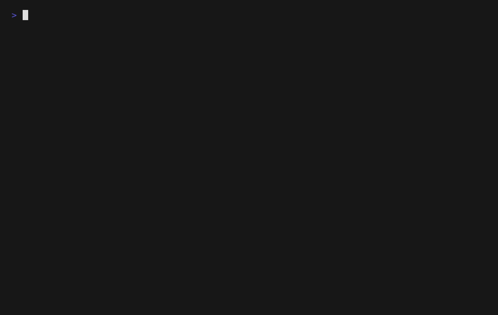

childflow
===

<p align="center">

</p>

childflow is a per-command-tree network sandbox for Linux.
Run one command and its child processes in an isolated network context, control DNS / hosts / proxy behavior, apply outbound policy, capture only that tree's traffic, and emit structured flow logs for that tree.

## About

`childflow` runs one command tree in an isolated network context and applies DNS, hosts, proxy, sandbox, policy, and capture controls only to that tree.

This is useful for tools that do not honor proxy environment variables consistently. `childflow` forces the proxy at the command tree's network path instead of relying on `HTTP_PROXY`, `HTTPS_PROXY`, or `LD_PRELOAD`-style interception.

It has two Linux backends: `rootless-internal` for the default day-to-day path, and `rootful` via `--root` when you need host-integrated behavior such as `--iface` or transparent interception.

- affects only the target command tree, not the whole host session
- can force DNS, `/etc/hosts`, proxying, sandbox policy, packet capture, structured flow logging, and reusable profiles per command tree
- can force proxying without depending on `HTTP_PROXY`, `HTTPS_PROXY`, or `LD_PRELOAD` tricks
- can apply allow / deny CIDR policy and default-deny rules to outbound traffic
- defaults to `rootless-internal`
- uses `--root` only for features like `--iface` and transparent interception

## Examples

<table>
  <tr>
    <td valign="top">
      <br />
      <strong>Proxy control and capture</strong><br /><br />
      <pre><code>childflow --profile ./docker/demo/profiles/http-origin.toml</code></pre>
      Block direct access, force the command tree through a proxy, and inspect only that tree's capture.<br />
    </td>
    <td valign="top">
      <br />
      <strong>Reusable profiles</strong><br /><br />
      <pre><code>childflow --profile ./profiles/default-deny.toml --dump-profile</code></pre>
      Keep sandbox settings in TOML, inherit from a base profile, and inspect the merged effective configuration.<br />
    </td>
    <td valign="top">
      <br />
      <strong>Structured flow logs</strong><br /><br />
      <pre><code>childflow --summary --flow-log ./flow.jsonl -- curl https://example.com</code></pre>
      Record structured DNS, connect, and policy events for the command tree without dropping down to packet-level inspection first.<br />
    </td>
  </tr>
</table>

## Install

### cargo

```bash
cargo install childflow
```

### Requirements

Host requirements:

- Linux only
- `ip`
- `iptables`
- `ip6tables`

Additional `rootless-internal` requirements:

- user, network, and mount namespace support
- `/dev/net/tun`
- user namespaces enabled on the host
- `uidmap` is recommended on Debian / Ubuntu style systems for `newuidmap` / `newgidmap` fallback

Additional `rootful` requirements:

- root privileges
- writable `/proc/sys/net/ipv4/ip_forward`
- writable `/proc/sys/net/ipv6/conf/all/forwarding`
- Linux features required for TPROXY when proxy interception is used

If you are evaluating from macOS or another non-Linux environment, use the Docker workflows instead of trying to run the binary directly.

## Usage

```text
$ childflow --help
Run one command tree inside a controlled network sandbox

Usage: childflow [OPTIONS] [COMMAND]...

Arguments:
  [COMMAND]...  Command to execute

Options:
      --profile <PROFILE>
          Load effective defaults from a TOML profile file. Explicit CLI flags override the profile
      --dump-profile
          Print the effective profile as TOML and exit
  -c, --capture <OUTPUT>
          Write only the target command tree's traffic as pcapng
  -C, --capture-point <OUTPUT_VIEW>
          Select which capture point or view `--capture` should write. `child` is the current stable view [default: child] [possible values: child, egress, wire-egress, both]
      --root
          Use the rootful backend. Without this flag, childflow uses the default rootless backend
      --doctor
          Diagnose whether the current host is ready for the selected backend
      --report <REPORT>
          Read a structured flow log and print a report instead of running a command
      --report-format <REPORT_FORMAT>
          Select the output format for `--report` [possible values: text, markdown]
  -d, --dns <DNS>
          Force DNS traffic for the child tree to this IPv4 or IPv6 resolver
      --hosts-file <HOSTS_FILE>
          Bind-mount an `/etc/hosts`-format file over the child's `/etc/hosts` so those entries are consulted first during name resolution
  -p, --proxy <PROXY>
          Configure an upstream proxy URI, for example http://127.0.0.1:8080, https://proxy.example.com:443, or socks5://host.docker.internal:10080. `--root` uses transparent interception, while the default rootless backend relays outbound TCP through the selected proxy from the parent-side engine
  -U, --proxy-user <PROXY_USER>
          Username for upstream proxy authentication
  -P, --proxy-password <PROXY_PASSWORD>
          Password for upstream proxy authentication
      --proxy-insecure
          Ignore certificate trust errors for https:// upstream proxies while still validating the hostname
      --summary
          Print a post-run summary to stderr
      --flow-log <FLOW_LOG>
          Write structured flow events as JSON Lines. Currently supported only by the default rootless backend
      --offline
          Block all outbound networking for the child tree, including DNS forwarding
      --block-private
          Block child-tree traffic to private, loopback, link-local, and ULA-style destinations
      --block-metadata
          Block common cloud metadata endpoints such as 169.254.169.254
      --default-policy <DEFAULT_POLICY>
          Choose whether unmatched outbound destinations are allowed or denied [default: allow] [possible values: allow, deny]
      --allow-cidr <ALLOW_CIDRS>
          Allow outbound destinations that fall within this IPv4 or IPv6 CIDR
      --deny-cidr <DENY_CIDRS>
          Deny outbound destinations that fall within this IPv4 or IPv6 CIDR
      --proxy-only
          Require outbound traffic to use the configured upstream proxy path
      --fail-on-leak
          Exit non-zero if childflow blocks traffic that the child process did not treat as fatal. Currently supported only by the default rootless backend
  -i, --iface <IFACE>
          Force the host-side egress interface for the child's direct traffic
  -h, --help
          Print help
  -V, --version
          Print version
```

### CLI Examples

#### Basic

Run one command tree with the default rootless backend:

```bash
childflow -- curl https://example.com
```

Capture only that tree's traffic:

```bash
childflow -c rootless.pcapng -- curl https://example.com
```

Force DNS resolution through a specific resolver:

```bash
childflow -d 1.1.1.1 -- curl https://example.com
```

Override `/etc/hosts` for just this command tree:

```bash
childflow --hosts-file ./hosts.override -- curl http://demo.internal
```

#### Policy

Run completely offline:

```bash
childflow --offline -- cargo test
```

Block common cloud metadata endpoints:

```bash
childflow --block-metadata -- ./my-client
```

Block private, loopback, and link-local destinations:

```bash
childflow --block-private -- curl https://example.com
```

Switch to default-deny and allow only one destination:

```bash
childflow \
  --default-policy deny \
  --allow-cidr 203.0.113.10/32 \
  -- curl http://203.0.113.10/
```

Block a destination range explicitly:

```bash
childflow --deny-cidr 10.0.0.0/8 -- ./scanner
```

#### Proxy

Force a simple HTTP proxy path:

```bash
childflow -p http://127.0.0.1:8080 -- curl https://example.com
```

Run a tool that would not normally honor proxy environment variables:

```bash
childflow \
  -p http://127.0.0.1:8080 \
  -- gobuster dir -u http://target.local/ -w ./wordlist.txt
```

Use an authenticated HTTPS upstream proxy:

```bash
childflow \
  -p https://proxy.example.com:443 \
  -U alice \
  -P secret \
  -- curl https://example.com
```

Require all outbound TCP to use the configured proxy path:

```bash
childflow \
  --proxy-only \
  -p http://127.0.0.1:8080 \
  -- curl https://example.com
```

Treat blocked direct traffic as a failed run:

```bash
childflow \
  --proxy-only \
  --fail-on-leak \
  -p http://127.0.0.1:8080 \
  -- ./client
```

#### Profiles

Run a stored profile as-is:

```bash
childflow --profile ./profiles/default-deny.toml
```

Load a profile and still override the command on the CLI:

```bash
childflow --profile ./profiles/default-deny.toml -- curl https://example.com
```

Inspect the merged effective profile after CLI overrides:

```bash
childflow \
  --profile ./profiles/default-deny.toml \
  --deny-cidr 198.51.100.0/24 \
  --dump-profile
```

#### Observability

Write a structured flow log for later inspection:

```bash
childflow \
  --flow-log ./flow.jsonl \
  --deny-cidr 10.0.0.0/8 \
  -- curl https://example.com
```

Print a post-run summary with top targets and common failure reasons:

```bash
childflow \
  --summary \
  --flow-log ./flow.jsonl \
  --deny-cidr 10.0.0.0/8 \
  -- curl https://example.com
```

Render a text or Markdown report from a saved flow log:

```bash
childflow --report ./flow.jsonl
childflow --report ./flow.jsonl --report-format markdown
```

Check what the current host can support before running:

```bash
childflow --doctor
childflow --root --doctor
```

#### Rootful

Use the rootful backend when you need host-integrated behavior:

```bash
sudo childflow --root -c capture.pcapng -- curl https://example.com
```

#### ICMP and Traceroute

Run `ping` inside the isolated command tree:

```bash
childflow -- ping -c 1 8.8.8.8
childflow -- ping -6 -c 1 2606:4700:4700::1111
```

Run `traceroute` inside the isolated command tree:

```bash
childflow -- traceroute -n -q 1 -w 2 8.8.8.8
childflow -- traceroute -I -n -q 1 -w 2 8.8.8.8
```

## Description

### Backend Summary

| Feature                    | `rootless-internal`                                               | `rootful`                                                              |
| -------------------------- | ----------------------------------------------------------------- | ---------------------------------------------------------------------- |
| Isolated execution         | Yes                                                               | Yes                                                                    |
| DNS override               | Yes                                                               | Yes                                                                    |
| `/etc/hosts` override      | Yes                                                               | Yes                                                                    |
| Outbound TCP               | Yes                                                               | Yes                                                                    |
| UDP relay                  | Yes                                                               | Yes                                                                    |
| Proxy support              | Yes, via parent-side relay engine                                 | Yes, via transparent interception path                                 |
| Policy controls            | Yes                                                               | Yes                                                                    |
| Structured flow log        | Yes                                                               | Not yet                                                                |
| `--fail-on-leak`           | Yes                                                               | Not yet                                                                |
| Transparent proxy / TPROXY | No                                                                | Yes                                                                    |
| `--iface`                  | No                                                                | Yes                                                                    |
| Packet capture             | Optional, with `child`, `egress`, `wire-egress`, and `both` views | Optional, with `child`, `egress`, `wire-egress`, and `both` views      |
| Status                     | Default and recommended path                                      | Advanced fallback for features that still require host-side networking |

Use `rootless-internal` by default. It is the main path for isolated execution, DNS control, proxying, packet capture, `ping`, and `traceroute` without host-wide rootful setup.

Use `--root` when you specifically need host-integrated behavior that the rootless path does not expose yet, including:

- transparent proxying
- interface-forced direct egress with `--iface`
- broader raw-ICMP behavior than the current rootless relay engine implements

### Policy Controls

`childflow` can treat the command tree as a small outbound policy domain.

- `--offline`
  deny all outbound traffic and disable DNS forwarding
- `--block-private`
  deny private, loopback, link-local, and ULA-style destinations
- `--block-metadata`
  deny common cloud metadata endpoints
- `--default-policy deny`
  deny destinations unless they match an explicit allow rule
- `--allow-cidr`
  allow IPv4 or IPv6 CIDRs
- `--deny-cidr`
  deny IPv4 or IPv6 CIDRs
- `--proxy-only`
  require outbound traffic to use the configured proxy path
- `--fail-on-leak`
  return non-zero when childflow blocks traffic but the child process still exits `0`

Current notes:

- `--proxy-only` is primarily a TCP-focused control; in the rootless backend, direct DNS / UDP / ICMP traffic is also blocked rather than relayed
- `--fail-on-leak` is currently supported only by `rootless-internal`

### Profiles

`childflow` can load reusable TOML profiles with `--profile`.

```bash
childflow --profile ./profiles/default-deny.toml
```

```toml
extends = "./base.toml"
capture = "./captures/run.pcapng"
flow_log = "./logs/run.jsonl"
dns = "1.1.1.1"
backend = "rootless-internal"
block_private = true
block_metadata = true
default_policy = "deny"
allow_cidrs = ["203.0.113.10/32"]
command = ["curl", "https://203.0.113.10/healthz"]
```

You can also print the merged effective profile after CLI overrides:

```bash
childflow \
  --profile ./profiles/default-deny.toml \
  --deny-cidr 198.51.100.0/24 \
  --dump-profile
```

Current notes:

- profile files currently use TOML
- profiles can inherit from a shared base with `extends = "./base.toml"`
- merge order is: parent profile, child profile, then explicit CLI flags
- CLI flags override profile values when both are present
- for list-valued settings such as `allow_cidrs` and `deny_cidrs`, explicit CLI flags replace the profile list instead of appending to it
- an explicit CLI command after `--` replaces the profile `command`
- `--dump-profile` prints the merged effective TOML and exits without running the command
- relative paths inside a profile are resolved relative to the profile file itself
- profile keys use command-oriented names such as `capture`, `capture_point`, `backend`, `flow_log`, `default_policy`, `allow_cidrs`, and `deny_cidrs`
- `--root` remains a CLI-only convenience flag; use `backend = "rootful"` in profiles when you want the rootful backend
- the fuller key-by-key schema is documented in [docs/profile-schema.md](docs/profile-schema.md)

### Flow Log

`childflow` can emit structured JSON Lines flow events with `--flow-log`.

```bash
childflow --flow-log ./flow.jsonl -- curl https://example.com
```

```bash
childflow --summary --flow-log ./flow.jsonl -- curl https://example.com
```

Current event types:

- `dns_query`
- `dns_answer`
- `connect_attempt`
- `connect_result`
- `policy_violation`
- `flow_end`
- `runtime_failure`

Current schema notes:

- every event includes `schema_version: 1`
- `connect_attempt`, `connect_result`, and `flow_end` include stable `remote_ip` / `remote_port` fields
- `connect_result.status` is currently one of `ok` or `error`
- `dns_query` and `dns_answer` include stable `server_ip` / `server_port` fields
- `dns_answer.mode` is currently one of `relayed` or `synthetic_empty`
- `policy_violation` includes structured fields such as `action`, `reason_code`, `control`, and `matched_cidr` when applicable

Current notes:

- `--flow-log` is currently supported only by `rootless-internal`
- each line is standalone JSON, so it is easy to inspect with tools such as `jq`
- flow logs complement `--capture`; use `--capture` for packet-level inspection and `--flow-log` for higher-level execution tracing
- `runtime_failure` records stable `reason_code` values such as `tap_create_blocked` or `packet_capture_blocked` when setup or runtime fails
- `--summary` will also show aggregate flow-log event counts, the top connection target, common connect errors, and runtime failure reason codes after the run
- `--report ./flow.jsonl` renders a fuller post-run report from the saved flow log
- `--report-format markdown` emits a Markdown report that is convenient for artifacts or issue comments
- the fuller event-by-event schema is documented in [docs/flow-log-schema.md](docs/flow-log-schema.md)

### Doctor and Report

`childflow --doctor` is the quickest way to see whether the current host can support the selected backend.

- for `rootless-internal`, it checks capability-oriented items such as user namespaces, uidmap helpers, `/dev/net/tun`, AF_PACKET capture, and Ubuntu-style AppArmor userns restrictions
- for `rootful`, it checks root privileges, forwarding sysctls, required external commands, and AF_PACKET capture

After a run, `childflow --report ./flow.jsonl` turns the saved flow log into a text or Markdown summary with:

- event counts
- protocol counts
- proxy usage
- policy violation reason counts
- connect error counts
- runtime failure reason counts
- top connection targets

### Capture Modes

`childflow` is intended to capture only the target command tree's traffic, not unrelated host traffic.

The default `child` mode keeps the isolated child-side view.

- `egress`
  synthetic egress-oriented view on both backends
- `wire-egress`
  real host egress capture on both backends
- `both`
  writes sibling `.child.pcapng` and `.egress.pcapng` files

Generated `pcapng` files also embed metadata describing the capture view, backend, kind, and interface.

For the fuller comparison of current capture points and the planned `child` / `egress` / `wire-egress` / `both` capture-point direction, see [docs/technical-details.md](docs/technical-details.md).


## License

MIT. See [LICENSE](LICENSE).
