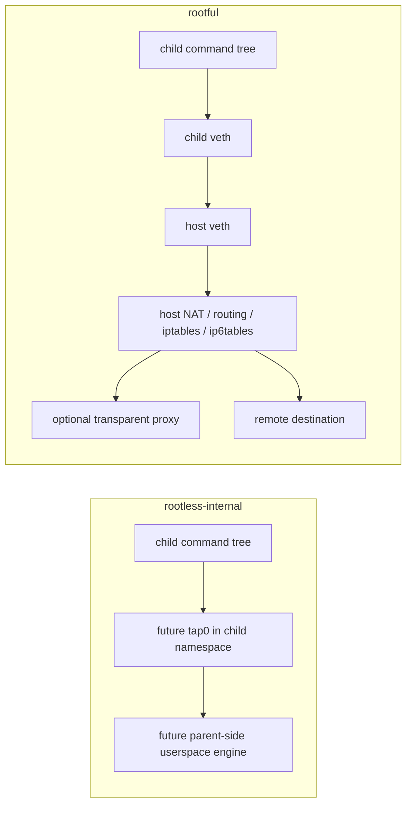

childflow
===

`childflow` is a Linux-only CLI for running a child process tree inside an isolated network namespace, forcing DNS / proxy behavior for that tree, and capturing only that tree's traffic.

## Description

`childflow` launches a command in an isolated networking environment and applies network controls only to the spawned process tree.

It is designed for cases like:

- forcing a specific DNS resolver only for the target command tree
- overlaying a custom `/etc/hosts` view only for the target command tree
- sending outbound TCP through an upstream proxy when the selected backend supports it
- capturing only the packets emitted by that target command tree

`childflow` currently provides two Linux backends:

- `rootful`
  default backend. Feature-complete backend built on veth, routing, iptables / ip6tables, and host-side capture
- `rootless-internal`
  experimental backend under construction. It is being introduced in phases so the backend split, validation, and preflight wiring can be reviewed before the internal userspace networking engine is enabled

### Features

- Run a child process tree inside an isolated network namespace
- Force DNS to a specific IPv4 or IPv6 resolver
- Overlay an `/etc/hosts`-format file only for the target command tree
- Capture only the target command tree's traffic as `pcapng`
- Choose between the stable `rootful` backend and the experimental `rootless-internal` backend

## Install

### Build from source

```bash
cargo build --release
sudo install -m 0755 target/release/childflow /usr/local/bin/childflow
```

### Requirements

Host requirements:

- Linux only

Additional `rootless-internal` requirements:

- user, network, and mount namespace support
- `/dev/net/tun`
- user namespaces enabled on the host
- TUN/TAP access permitted by the host or container runtime

Additional `rootful` requirements:

- root privileges
- `ip`
- `iptables`
- `ip6tables`
- writable `/proc/sys/net/ipv4/ip_forward`
- writable `/proc/sys/net/ipv6/conf/all/forwarding`
- Linux features required for TPROXY when proxy interception is used

If you are evaluating from macOS or another non-Linux environment, use the Docker workflows instead of trying to run the binary directly.

## Usage

### Command

```bash
childflow [OPTIONS] -- <command> [args...]
```

### Help

`childflow --help` gives you the full CLI reference. The main shape is:

```text
Launch a child process tree inside its own netns and capture only its packets

Usage:
  childflow [OPTIONS] -- <COMMAND>...

Options:
  -o, --output <PATH>            Write only the target command tree's traffic as pcapng
      --network-backend <BACKEND>
                                 Select the networking backend [default: rootful] [possible values: rootful, rootless-internal]
  -d, --dns <IP>                 Force DNS traffic for the child tree to this resolver
      --hosts-file <PATH>        Overlay an /etc/hosts-format file for the child tree
  -p, --proxy <URI>              Upstream proxy: http://, https://, or socks5://
      --proxy-user <USER>        Username for upstream proxy authentication
      --proxy-password <PASS>    Password for upstream proxy authentication
      --proxy-insecure           Ignore certificate trust errors for https proxies
  -i, --iface <NAME>             Force host-side direct egress interface on rootful
  -h, --help                     Print help
  -V, --version                  Print version
```

### Options

Main options:

- `--network-backend <BACKEND>`
  select `rootful` or `rootless-internal`
- `-o, --output <PATH>`
  write captured traffic as `pcapng`
- `-d, --dns <IP>`
  force DNS to the specified IPv4 or IPv6 resolver
- `--hosts-file <PATH>`
  overlay an `/etc/hosts`-format file for the target command tree
- `-p, --proxy <URI>`
  configure an upstream `http://`, `https://`, or `socks5://` proxy
- `--proxy-user <USER>`
  username for proxy authentication
- `--proxy-password <PASS>`
  password for proxy authentication
- `--proxy-insecure`
  ignore certificate trust failures for `https://` upstream proxies while still validating the hostname
- `-i, --iface <NAME>`
  force direct host-side egress through a specific interface on `rootful`

Notes:

- `rootless-internal` is experimental and under construction
- `--iface` is not supported by `rootless-internal`
- `--proxy`, `--proxy-user`, `--proxy-password`, and `--proxy-insecure` are not yet supported by `rootless-internal`
- `--output` is not yet supported by `rootless-internal`
- `--proxy-insecure` is valid only for `https://` upstream proxies
- packet capture is currently available on `rootful`; `rootless-internal` capture wiring is planned for a later phase

### Backend Comparison

| Feature | `rootless-internal` | `rootful` |
| --- | --- | --- |
| Isolated execution | Yes | Yes |
| DNS override | Planned next phase | Yes |
| `/etc/hosts` override | Yes | Yes |
| Outbound TCP | Not yet implemented | Yes |
| UDP relay | Not yet implemented | Yes |
| Proxy support | Not yet implemented | Yes, via transparent interception path |
| Transparent proxy / TPROXY | No | Yes |
| `--iface` | No | Yes |
| Packet capture | Not yet implemented | Optional, at host-side veth when `--output` is set |
| Status | Experimental, phase-1 scaffolding | Current feature-complete backend |

### Which backend should I use?

Use `rootful` when you need the current feature-complete path, including:

- transparent proxying
- interface-forced direct egress with `--iface`

Use `rootless-internal` when you want to help validate the new internal backend structure itself. In the current phase it mainly exists so backend selection, validation, and preflight checks can be reviewed before outbound networking support is enabled.

### Backend Diagram



In short:

- `rootless-internal` will keep more of the networking logic in a parent-side userspace relay attached to `tap0`, but that path is still under construction in this phase
- `rootful` pushes more of the data path into Linux host networking with veth, routing, NAT, and optional transparent interception

### Packet Capture

`childflow` is intended to capture only the target command tree's traffic, not unrelated host traffic.

Capture behavior differs by backend:

- `rootless-internal`
  capture support is planned but not yet enabled in this phase
- `rootful`
  capture is taken on the host-side veth before later host-side proxying, NAT, or routing stages

That means capture files show the isolated child-side traffic view, not arbitrary host traffic.

### Docker Workflows

If you are developing or evaluating from a non-Linux host, use the included Docker workflows:

- Developer environment: [docker/dev/README.md](docker/dev/README.md)
- Demo environment: [docker/demo/README.md](docker/demo/README.md)

### Troubleshooting

Useful checks:

```bash
which ip iptables ip6tables
childflow --network-backend rootful -- true
sudo childflow --network-backend rootful -o /tmp/test.pcapng -- true
docker compose -f docker/dev/compose.yml run --rm childflow-dev cargo test
```

Common issues:

- `ip`, `iptables`, or `ip6tables` not found
  install `iproute2` and the appropriate firewall userspace package
- `rootless-internal` preflight fails
  check user namespace availability, `/dev/net/tun`, and `/proc/self/ns/{user,net,mnt}`
- `rootless-internal` rejects `--proxy` or `--output`
  that is expected in phase 1; those features will be enabled in later phases
- packet capture fails to start
  verify AF_PACKET support or rootless tap access, depending on the selected backend

For lower-level backend details, limitations, and maintainer-oriented validation commands, see [docs/technical-details.md](docs/technical-details.md).

### Limitations

- Linux only
- backend support is still asymmetric: `rootful` is the feature-complete path, while `rootless-internal` is still experimental
- `rootless-internal` is currently limited to backend selection, validation, and preflight scaffolding
- abnormal termination can still leave partial host-side network changes behind even though rollback is attempted

## Example

### Run a command

Run a command with the default backend.

```bash
childflow -- curl https://example.com
```

### Capture only the target command tree

Write only the target command tree's traffic as `pcapng`.

```bash
childflow --network-backend rootful -o rootful.pcapng -- curl https://example.com
```

```shell
childflow@docker-desktop:/workspaces/childflow$ sudo ./target/debug/childflow --network-backend rootful -o /tmp/rootful.pcapng -- curl https://example.com
<!doctype html><html lang="en"><head><title>Example Domain</title><meta name="viewport" content="width=device-width, initial-scale=1"><style>body{background:#eee;width:60vw;margin:15vh auto;font-family:system-ui,sans-serif}h1{font-size:1.5em}div{opacity:0.8}a:link,a:visited{color:#348}</style></head><body><div><h1>Example Domain</h1><p>This domain is for use in documentation examples without needing permission. Avoid use in operations.</p><p><a href="https://iana.org/domains/example">Learn more</a></p></div></body></html>
childflow@docker-desktop:/workspaces/childflow$
childflow@docker-desktop:/workspaces/childflow$ tcpdump -nn -tttt -r /tmp/rootful.pcapng
reading from file /tmp/rootful.pcapng, link-type EN10MB (Ethernet), snapshot length 65535
2026-04-19 14:04:22.530769 IP 10.240.153.78.60415 > 10.240.153.77.53: 5035+ A? example.com. (29)
2026-04-19 14:04:22.533252 IP 10.240.153.77.53 > 10.240.153.78.60415: 5035 2/0/0 A 104.20.23.154, A 172.66.147.243 (83)
2026-04-19 14:04:22.543459 IP 10.240.153.78.35950 > 104.20.23.154.443: Flags [S], seq 832149090, win 64240, length 0
2026-04-19 14:04:22.548625 IP 104.20.23.154.443 > 10.240.153.78.35950: Flags [S.], seq 548580286, ack 832149091, win 64240, length 0
2026-04-19 14:04:22.548670 IP 10.240.153.78.35950 > 104.20.23.154.443: Flags [.], ack 1, win 64240, length 0
```

### Force DNS

Force DNS only for the target command tree.

```bash
childflow -d 1.1.1.1 -- curl https://example.com
```

### Overlay a hosts file

Overlay a custom hosts file only for the target command tree.

```bash
childflow --hosts-file ./hosts.override -- curl http://demo.internal
```

### Use an upstream proxy

Relay outbound TCP through an upstream proxy.

```bash
sudo childflow --network-backend rootful -p http://127.0.0.1:8080 -- curl https://example.com
```

### Use proxy authentication

Run with authenticated upstream proxy settings.

```bash
sudo childflow --network-backend rootful \
  -p https://proxy.example.com:443 \
  --proxy-user alice \
  --proxy-password secret \
  -- curl https://example.com
```

### Use the rootful backend

Use the feature-complete rootful backend.

```bash
sudo childflow --network-backend rootful -o capture.pcapng -- curl https://example.com
```

### Run ping

Run `ping` through the rootful backend.

```bash
sudo childflow --network-backend rootful -- ping -c 1 8.8.8.8
sudo childflow --network-backend rootful -- ping -6 -c 1 2606:4700:4700::1111
```

### Run traceroute

Run both UDP-style and ICMP-mode `traceroute`.

```bash
sudo childflow --network-backend rootful -- traceroute -n -q 1 -w 2 8.8.8.8
sudo childflow --network-backend rootful -- traceroute -I -n -q 1 -w 2 8.8.8.8
```

## License

MIT. See [LICENSE](LICENSE).
