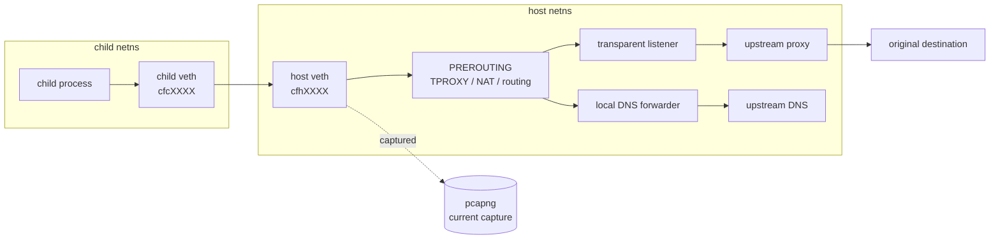

childflow
===

## about

`childflow` is a Linux CLI tool for running a child process tree inside an isolated network environment. It lets you control how that process resolves DNS, uses an upstream proxy, routes TCP traffic through a transparent tunnel, and captures only the packets generated by the target process.

This tool relies on Linux kernel features and only runs on Linux.

## Feature

- `Proxy`: Override the proxy used by the target command with a specified upstream proxy.
- `DNS`: Override the DNS resolver used by the target command with a specified IPv4 DNS server.
- `Tunnel`: Redirect the target command's TCP traffic through a transparent tunnel inside an isolated network namespace.
- `Packet capture`: Capture only the target command's traffic and save it in `pcapng` format.


## How to use

Run `childflow` as root and place the target command after `--`.

Root privileges are required because `childflow` creates isolated network and mount namespaces, installs routing and `iptables`/TPROXY rules, and opens an `AF_PACKET` capture socket.

```bash
sudo childflow -o <output.pcapng> [options...] -- <command> [args...]
```

Examples:

```bash
sudo childflow -o capture.pcapng -- curl https://example.com
sudo childflow -o capture.pcapng -d 1.1.1.1 -- curl https://example.com
sudo childflow -o capture.pcapng -p http://127.0.0.1:8080 -- curl https://example.com
sudo childflow -o capture.pcapng -i eth0 -- curl https://example.com
```

Options:

- `-o, --output <PATH>`: Write captured traffic to a `pcapng` file.
- `-d, --dns <IPv4>`: Force the child process tree to use a specific IPv4 DNS resolver.
- `-p, --proxy <URI>`: Force TCP traffic through an upstream proxy such as `http://127.0.0.1:8080` or `socks5://127.0.0.1:1080`.
- `-i, --iface <NAME>`: Force direct egress traffic to use a specific host interface.

### Example


## Note

### Packet capture

Packet capture is taken at the `host veth (cfhXXXX)` point shown in this diagram. If you combine it with other options that modify or relay packets later in the path, only the packets visible at this capture point can be recorded; packets after those later stages cannot be captured here.


