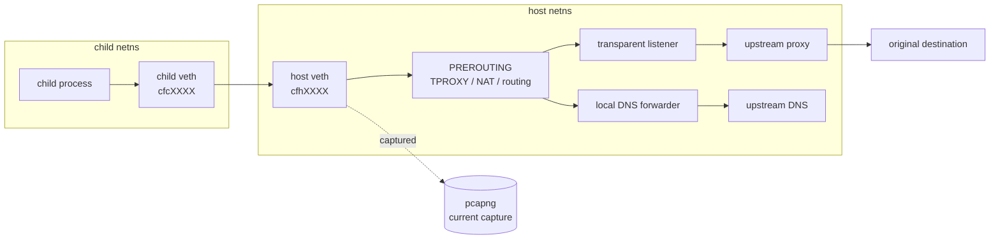

childflow Technical Details
===

This document collects the lower-level backend notes, capture details, troubleshooting guidance, and maintainer-oriented commands that are intentionally kept out of the top-level README.

## Backend Matrix

| Feature | `rootful` | `rootless-internal` |
| --- | --- | --- |
| Isolated execution | Yes | Yes |
| DNS override | Yes | Yes, via child `resolv.conf` rewrite and internal DNS relay |
| `/etc/hosts` override | Yes | Yes |
| Outbound TCP | Yes | Yes |
| ICMP | Yes | IPv4 / IPv6 echo requests and replies, plus traceroute-style ICMP error relay for both UDP and ICMP echo probes |
| UDP | Yes | Yes |
| Explicit upstream proxy | Yes, via transparent interception path | Yes, via parent-side relay engine |
| Transparent proxy / TPROXY | Yes | Not supported |
| `--iface` | Yes | Not supported |
| Packet capture | Yes, via host-side AF_PACKET on the veth path | Yes, via tap/engine-boundary capture when `--output` is set |
| Status | Current feature-complete backend | Experimental |

## Backend Notes

- `rootful` currently requires `--output`
- `rootful` is enabled explicitly with `--root` when you want the current feature-complete backend
- `rootless-internal` currently rejects `--iface` and transparent proxy / TPROXY behavior because those paths are not implemented yet
- `rootless-internal` supports child isolation, DNS relay, outbound TCP, generic UDP relay, IPv4 / IPv6 ICMP echo relay for `ping`, traceroute-style ICMP error relay for both UDP and ICMP echo probes, relay-based HTTP / HTTPS / SOCKS5 upstream proxying, `/etc/hosts` override, and tap/engine-boundary packet capture via `--output`
- outbound non-echo ICMP request types generated directly by the child are still not implemented on `rootless-internal`

## How It Works

### `rootful`

1. `childflow` validates CLI arguments and runs preflight checks.
2. A child is forked and unshares the required namespaces.
3. A veth pair connects the child namespace to the host namespace.
4. The host enables forwarding and installs IPv4 / IPv6 NAT and forwarding rules.
5. Optional policy-routing rules force direct traffic through `--iface`.
6. Optional TPROXY rules redirect TCP traffic to the local transparent listener, which then connects to the configured upstream proxy.
7. Packet capture runs on the host-side veth.

### `rootless-internal`

1. `childflow` validates CLI arguments and runs preflight checks.
2. A child is forked and unshares user, network, and mount namespaces when available.
3. The child creates `tap0`, gets a rewritten `resolv.conf`, and receives a merged `/etc/hosts` view when `--hosts-file` is set.
4. The parent-side userspace engine attaches to the tap and relays UDP, outbound TCP, IPv4 / IPv6 ICMP echo requests, and traceroute-style ICMP error responses for both UDP and ICMP echo probes.
5. If `--proxy` is set, the parent-side engine tunnels outbound TCP through HTTP, HTTPS, or SOCKS5 upstream proxying.
6. If `--output` is set, packet capture is written from the tap/engine boundary.

For non-root users, `childflow` first tries direct uid/gid mapping, then falls back to `newuidmap` / `newgidmap`, and finally to a uid-only mapping when the host rejects gid mapping but still permits enough user-namespace functionality to continue.

## Packet Capture Behavior

### `rootful`

Capture happens on the host-side veth, shown below as `cfhXXXX`.



What is captured:

- packets emitted by the target process tree into the isolated namespace
- DNS requests from that process tree before they leave the host-side veth
- TCP flows before later host-side TPROXY, NAT, or proxy relaying stages

What is not captured:

- packets generated by unrelated host processes
- traffic after it leaves the host-side veth and is rewritten or relayed later in the host stack
- packets created by the upstream proxy server itself on another machine

### `rootless-internal`

Capture is taken at the `tap0` / userspace-engine boundary instead of the host-side veth. That means the file shows what the child emitted into the isolated rootless network stack and what the engine returned to the child, not the host-side TCP stream after proxying or relay.

## Requirements

### Host requirements

- Linux only
- `ip`
- `iptables`
- `ip6tables`
- kernel support for network namespaces, policy routing, and veth

### `rootful`

- root privileges
- writable `/proc/sys/net/ipv4/ip_forward` and `/proc/sys/net/ipv6/conf/all/forwarding`
- transparent proxy mode additionally depends on Linux TPROXY support such as `xt_TPROXY`, `xt_socket`, and `IP_TRANSPARENT`
- packet capture depends on AF_PACKET support and privileges equivalent to `CAP_NET_RAW`

### `rootless-internal`

- Linux namespace support for user, network, and mount namespaces
- `/dev/net/tun`
- user namespace support enabled on the host
- on Debian / Ubuntu style hosts, the `uidmap` package is recommended so `childflow` can fall back to `newuidmap` / `newgidmap` when direct `/proc/<pid>/*_map` writes are rejected

## Troubleshooting

Typical checks:

```bash
which ip iptables ip6tables
childflow -- true
sudo childflow --root -o /tmp/test.pcapng -- true
docker compose -f docker/dev/compose.yml run --rm childflow-dev cargo test
sudo ip route show default
sudo ip -6 route show default
sudo iptables -t mangle -S
sudo ip6tables -t mangle -S
```

Common failures:

- `ip`, `iptables`, or `ip6tables` not found:
  install `iproute2` and the appropriate `iptables` userspace package
- privilege check fails:
  rerun `--root` with `sudo`; if this still fails inside a container or VM, verify the required capabilities are actually granted
- `rootless-internal` preflight fails:
  check user namespace availability, `/dev/net/tun`, and whether the host exposes `/proc/self/ns/{user,net,mnt}`
- `rootless-internal` namespace setup fails for a non-root user:
  install the Debian / Ubuntu `uidmap` package, check `/etc/subuid` and `/etc/subgid`, and rerun with `CHILDFLOW_DEBUG=1`
- `rootless-internal` reaches TCP destinations but DNS still fails:
  verify the selected upstream resolver is reachable from the parent namespace and rerun with `CHILDFLOW_DEBUG=1`
- `rootless-internal` proxying does not seem to take effect:
  verify the configured upstream proxy is reachable from the parent namespace and rerun with `CHILDFLOW_DEBUG=1`
- `rootless-internal` drops UDP traffic:
  verify that the remote peer actually sends a UDP response back; the current relay forwards datagrams, but it does not maintain richer session semantics beyond request/response forwarding
- `rootless-internal` can reach TCP destinations but `ping` still fails:
  the current rootless ICMP path only handles echo traffic; rerun with `CHILDFLOW_DEBUG=1` and confirm the target family matches the command you used
- `rootless-internal` still cannot run arbitrary raw-ICMP tools correctly:
  the rootless engine now handles `ping` and both UDP-style and ICMP-mode `traceroute`, but direct outbound non-echo ICMP request types are still limited
- packet capture startup fails:
  verify AF_PACKET support or rootless tap access, depending on the backend

Host conflicts to keep in mind:

- existing routing policy rules may interact with `--iface`
- host firewall managers may rewrite or reject `iptables` / `ip6tables` rules
- hardened container environments may mount `/proc/sys` read-only or block namespace operations
- Docker or other orchestration tools may already manipulate forwarding and NAT state on the host

## Limitations

- Linux only
- backend support is still asymmetric: `rootful` is the feature-complete path, while `rootless-internal` is still experimental
- direct traffic is dual-stack, but correctness still depends on the host having usable IPv4 and IPv6 upstream connectivity
- proxy mode currently targets TCP traffic
- rootless ICMP support still does not cover arbitrary outbound ICMP request types generated directly by the child
- DNS handling is designed around `resolv.conf`-driven resolution inside the child namespace
- abnormal termination can still leave partial host-side network changes behind even though rollback is attempted

## Safety Notes

`childflow` changes host networking state while it runs:

- sysctls such as `net.ipv4.ip_forward`, `net.ipv6.conf.all.forwarding`, and per-interface `rp_filter`
- host veth devices
- `iptables` and `ip6tables` filter / nat / mangle rules
- policy-routing rules and local routes used for `--iface` or TPROXY

Because of that:

- prefer a disposable VM, test machine, or the Docker demo when learning the tool
- avoid using it casually on a production host
- review cleanup warnings carefully if the process crashes or is interrupted
- keep `CHILDFLOW_DEBUG=1` handy when developing or debugging host-specific issues

## Validation

Useful local commands for maintainers:

```bash
cargo fmt
cargo clippy --all-targets --all-features -- -D warnings
cargo test
docker compose -f docker/dev/compose.yml run --rm childflow-dev cargo test
docker compose -f docker/dev/compose.yml run --rm childflow-dev cargo test --test rootless_proxy -- --ignored --nocapture
docker compose -f docker/demo/compose.yml run --rm childflow-demo /workspaces/childflow/docker/demo/run-demo.sh
```
