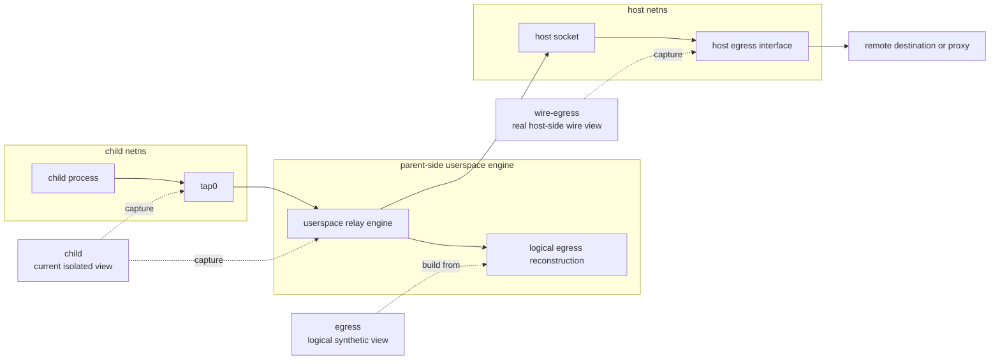
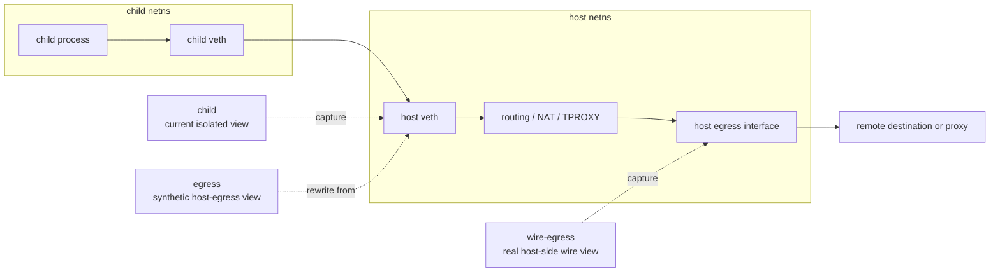

childflow Technical Details
===

This document keeps the lower-level backend, capture, troubleshooting, and maintainer notes that are intentionally trimmed out of the top-level README.

## Backend Summary

| Feature | `rootless-internal` | `rootful` |
| --- | --- | --- |
| Isolated execution | Yes | Yes |
| DNS override | Yes | Yes |
| `/etc/hosts` override | Yes | Yes |
| Outbound TCP | Yes | Yes |
| UDP | Yes | Yes |
| ICMP | Echo, traceroute-style errors, and best-effort broader relay | Yes |
| Explicit upstream proxy | Yes | Yes |
| Transparent proxy / TPROXY | No | Yes |
| `--iface` | No | Yes |
| Capture | `child`, `egress`, `wire-egress`, `both` | `child`, `egress`, `wire-egress`, `both` |
| Status | Default and recommended path | Advanced fallback |

Use `rootless-internal` by default. Use `--root` when you need host-integrated behavior such as `--iface` or transparent interception.

## Backend Flow

### `rootless-internal`

1. Validate CLI and run preflight.
2. Fork the child and unshare user, network, and mount namespaces when available.
3. Create `tap0`, rewrite `resolv.conf`, and overlay `/etc/hosts` when requested.
4. Attach the parent-side userspace engine to the tap.
5. Relay outbound TCP, UDP, DNS, and supported ICMP paths.
6. Optionally tunnel outbound TCP through HTTP / HTTPS / SOCKS5 upstream proxying.
7. Optionally write capture from the tap / engine boundary, or from the discovered host egress interface for `wire-egress`.

### `rootful`

1. Validate CLI and run preflight.
2. Fork the child and unshare namespaces.
3. Create a veth pair between child and host namespaces.
4. Enable forwarding and install NAT / forwarding rules.
5. Optionally install policy-routing rules for `--iface`.
6. Optionally install TPROXY rules for proxy interception.
7. Optionally start AF_PACKET capture.

For non-root users, `childflow` first tries direct uid/gid mapping, then falls back to `newuidmap` / `newgidmap`, and finally to uid-only mapping when the host allows enough user-namespace functionality to continue.

## Capture Points

`childflow` captures only the target command tree's traffic. The important part is not just whether capture is enabled, but where each capture mode is anchored.

### `rootless-internal`



- `child`
  capture is written at the `tap0` / userspace-engine boundary
- `egress`
  logical synthetic view reconstructed from the rootless child-side capture plus the discovered host egress IP
- `wire-egress`
  real AF_PACKET capture on the discovered host egress interface; with upstream proxying enabled, this shows the host-to-proxy wire view
- `both`
  writes `.child.pcapng` from the `child` point and `.egress.pcapng` from the logical `egress` view

### `rootful`



- `child`
  capture is taken on the host-side veth before later NAT, routing, or proxy interception
- `egress`
  synthetic view derived from that veth capture by rewriting the child endpoint IP to the discovered host egress IP
- `wire-egress`
  real AF_PACKET capture on the selected or discovered host egress interface
- `both`
  writes `.child.pcapng` from the `child` point and `.egress.pcapng` from the synthetic `egress` view

Generated `pcapng` files also embed metadata describing the capture `view`, `backend`, `kind`, and `interface`.

## Requirements

### Host

- Linux
- `ip`
- `iptables`
- `ip6tables`
- kernel support for namespaces, routing, and veth

### `rootless-internal`

- user, network, and mount namespace support
- `/dev/net/tun`
- user namespaces enabled on the host
- `uidmap` recommended on Debian / Ubuntu style systems

### `rootful`

- root privileges
- writable `/proc/sys/net/ipv4/ip_forward`
- writable `/proc/sys/net/ipv6/conf/all/forwarding`
- Linux TPROXY support when transparent interception is used
- AF_PACKET support and privileges equivalent to `CAP_NET_RAW` for capture

## Troubleshooting

Typical checks:

```bash
which ip iptables ip6tables
childflow --doctor
childflow -- true
sudo childflow --root -c /tmp/test.pcapng -- true
docker compose -f docker/dev/compose.yml run --rm childflow-dev cargo test
sudo ip route show default
sudo ip -6 route show default
sudo iptables -t mangle -S
sudo ip6tables -t mangle -S
```

Common failures:

- `ip`, `iptables`, or `ip6tables` not found
  install `iproute2` and the appropriate firewall userspace package
- `rootless-internal` preflight fails
  check user namespace availability, `/dev/net/tun`, and `/proc/self/ns/{user,net,mnt}`
- `rootless-internal` namespace setup fails for a non-root user
  install `uidmap`, check `/etc/subuid` and `/etc/subgid`, then retry with `CHILDFLOW_DEBUG=1`
- `rootless-internal` DNS or proxying does not behave as expected
  verify upstream reachability from the parent namespace and retry with `CHILDFLOW_DEBUG=1`
- `rootless-internal` non-echo ICMP still fails
  broader ICMP relay depends on raw ICMP socket access in the parent namespace
- packet capture startup fails
  verify AF_PACKET support or rootless tap access, depending on the backend

Host conflicts to keep in mind:

- existing policy-routing rules may interact with `--iface`
- host firewall managers may rewrite or reject `iptables` / `ip6tables` rules
- hardened container environments may mount `/proc/sys` read-only or block namespace operations
- Docker or other orchestration tools may already manipulate forwarding and NAT state

## Limitations

- Linux only
- rootless is the main path, but `--iface` and transparent proxy / TPROXY still require `--root`
- direct traffic is dual-stack only when the host actually has working upstream IPv4 and IPv6 connectivity
- proxy mode currently targets TCP traffic
- broader rootless ICMP still depends on host raw-socket access
- abnormal termination can still leave partial host-side network changes behind even though rollback is attempted

## Safety Notes

`childflow` changes host networking state while it runs:

- sysctls such as `net.ipv4.ip_forward`, `net.ipv6.conf.all.forwarding`, and per-interface `rp_filter`
- host veth devices
- `iptables` and `ip6tables` rules
- policy-routing rules and local routes used for `--iface` or TPROXY

Prefer a disposable VM, test host, or the Docker demo when learning or debugging host-specific behavior.

## Validation

Useful maintainer commands:

```bash
cargo fmt
cargo clippy --all-targets --all-features -- -D warnings
cargo test
docker compose -f docker/dev/compose.yml run --rm childflow-dev cargo test
docker compose -f docker/dev/compose.yml run --rm childflow-dev cargo test --test rootless_proxy -- --ignored --nocapture
docker compose -f docker/demo/compose.yml run --rm childflow-demo /workspaces/childflow/docker/demo/run-demo.sh
```
