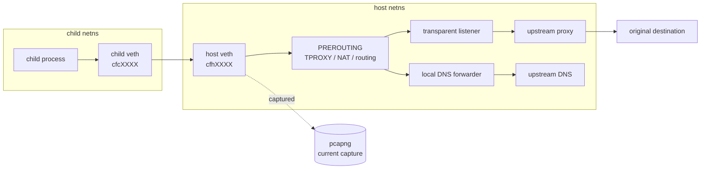

childflow Technical Details
===

This document collects the lower-level backend notes, capture details, troubleshooting guidance, and maintainer-oriented commands that are intentionally kept out of the top-level README.

## Backend Matrix

| Feature | `rootful` | `rootless-internal` |
| --- | --- | --- |
| Isolated execution | Yes | Yes |
| DNS override | Yes | Planned next phase |
| `/etc/hosts` override | Yes | Yes |
| Outbound TCP | Yes | Not yet implemented |
| ICMP | Yes | Not yet implemented |
| UDP | Yes | Not yet implemented |
| Explicit upstream proxy | Yes, via transparent interception path | Not yet implemented |
| Transparent proxy / TPROXY | Yes | Not supported |
| `--iface` | Yes | Not supported |
| Packet capture | Optional, via host-side AF_PACKET on the veth path when `--output` is set | Not yet implemented |
| Status | Current feature-complete backend | Experimental |

## Backend Notes

- `rootful` is the default backend and remains the feature-complete path in this phase
- `rootless-internal` is currently limited to backend selection, backend-specific validation, and backend-specific preflight checks
- `rootless-internal` currently rejects `--iface`, `--proxy`, proxy-auth / proxy-TLS options, and `--output` because those paths are not implemented yet in phase 1

## How It Works

### `rootful`

1. `childflow` validates CLI arguments and runs preflight checks.
2. A child is forked and unshares the required namespaces.
3. A veth pair connects the child namespace to the host namespace.
4. The host enables forwarding and installs IPv4 / IPv6 NAT and forwarding rules.
5. Optional policy-routing rules force direct traffic through `--iface`.
6. Optional TPROXY rules redirect TCP traffic to the local transparent listener, which then connects to the configured upstream proxy.
7. Packet capture runs on the host-side veth.

### `rootless-internal`

1. `childflow` validates CLI arguments and runs preflight checks.
2. The backend-specific preflight confirms Linux namespace handles, user-namespace availability, and `/dev/net/tun`.
3. The rootless internal networking engine remains under construction and will be enabled in later phases.

## Packet Capture Behavior

### `rootful`

Capture happens on the host-side veth, shown below as `cfhXXXX`.



What is captured:

- packets emitted by the target process tree into the isolated namespace
- DNS requests from that process tree before they leave the host-side veth
- TCP flows before later host-side TPROXY, NAT, or proxy relaying stages

What is not captured:

- packets generated by unrelated host processes
- traffic after it leaves the host-side veth and is rewritten or relayed later in the host stack
- packets created by the upstream proxy server itself on another machine

### `rootless-internal`

Capture is not implemented in phase 1. The future design is still expected to write capture at the `tap0` / userspace-engine boundary instead of the host-side veth, but that path is intentionally deferred until later phases.

## Requirements

### Host requirements

- Linux only
- kernel support for network namespaces, policy routing, and veth

### `rootful`

- root privileges
- `ip`
- `iptables`
- `ip6tables`
- writable `/proc/sys/net/ipv4/ip_forward` and `/proc/sys/net/ipv6/conf/all/forwarding`
- transparent proxy mode additionally depends on Linux TPROXY support such as `xt_TPROXY`, `xt_socket`, and `IP_TRANSPARENT`
- packet capture depends on AF_PACKET support and privileges equivalent to `CAP_NET_RAW`

### `rootless-internal`

- Linux namespace support for user, network, and mount namespaces
- `/dev/net/tun`
- user namespace support enabled on the host
- TUN/TAP access permitted by the host or container runtime

## Troubleshooting

Typical checks:

```bash
which ip iptables ip6tables
childflow --network-backend rootful -- true
sudo childflow --network-backend rootful -o /tmp/test.pcapng -- true
docker compose -f docker/dev/compose.yml run --rm childflow-dev cargo test
sudo ip route show default
sudo ip -6 route show default
sudo iptables -t mangle -S
sudo ip6tables -t mangle -S
```

Common failures:

- `ip`, `iptables`, or `ip6tables` not found:
  install `iproute2` and the appropriate `iptables` userspace package
- privilege check fails:
  rerun `--network-backend rootful` with `sudo`; if this still fails inside a container or VM, verify the required capabilities are actually granted
- `rootless-internal` preflight fails:
  check user namespace availability, `/dev/net/tun`, and whether the host exposes `/proc/self/ns/{user,net,mnt}`
- `rootless-internal` rejects `--proxy` or `--output`:
  that is expected in phase 1; those features are intentionally blocked until later phases land
- packet capture startup fails:
  verify AF_PACKET support or rootless tap access, depending on the backend

Host conflicts to keep in mind:

- existing routing policy rules may interact with `--iface`
- host firewall managers may rewrite or reject `iptables` / `ip6tables` rules
- hardened container environments may mount `/proc/sys` read-only or block namespace operations
- Docker or other orchestration tools may already manipulate forwarding and NAT state on the host

## Limitations

- Linux only
- backend support is still asymmetric: `rootful` is the feature-complete path, while `rootless-internal` is still experimental
- `rootless-internal` is intentionally limited to phase-1 scaffolding in the current branch state
- abnormal termination can still leave partial host-side network changes behind even though rollback is attempted

## Safety Notes

`childflow` changes host networking state while it runs:

- sysctls such as `net.ipv4.ip_forward`, `net.ipv6.conf.all.forwarding`, and per-interface `rp_filter`
- host veth devices
- `iptables` and `ip6tables` filter / nat / mangle rules
- policy-routing rules and local routes used for `--iface` or TPROXY

Because of that:

- prefer a disposable VM, test machine, or the Docker demo when learning the tool
- avoid using it casually on a production host
- review cleanup warnings carefully if the process crashes or is interrupted
- keep `CHILDFLOW_DEBUG=1` handy when developing or debugging host-specific issues

## Validation

Useful local commands for maintainers:

```bash
cargo fmt
cargo clippy --all-targets --all-features -- -D warnings
cargo test
docker compose -f docker/dev/compose.yml run --rm childflow-dev cargo test
docker compose -f docker/dev/compose.yml run --rm childflow-dev cargo test --test rootless_proxy -- --ignored --nocapture
docker compose -f docker/demo/compose.yml run --rm childflow-demo /workspaces/childflow/docker/demo/run-demo.sh
```
